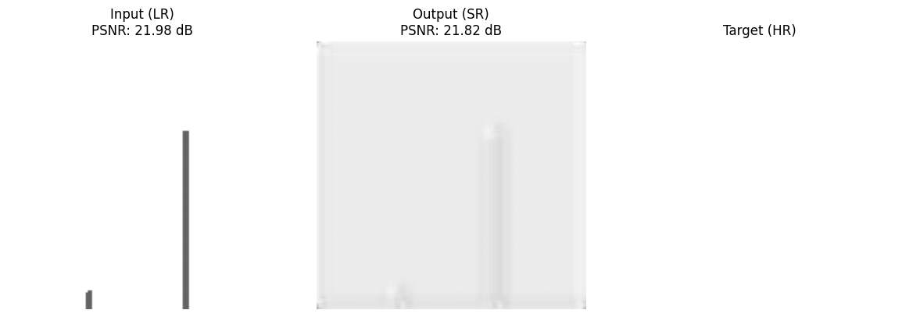
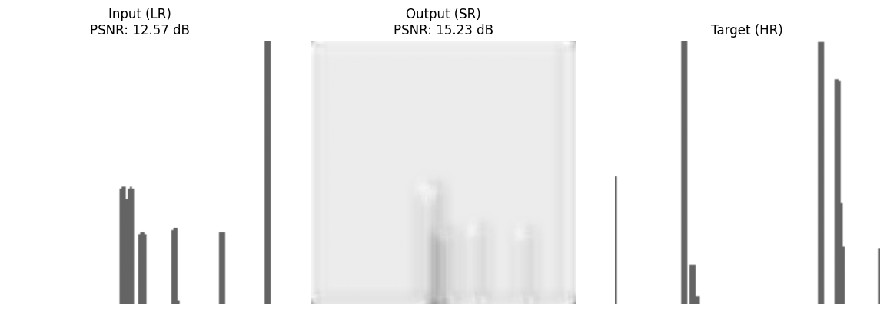
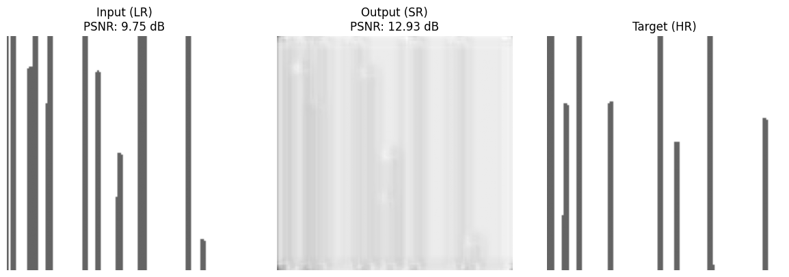

# Super-Resolution using CNN

This repository implements a lightweight **FFT super-resolution model** based on **SRCNN (Super-Resolution Convolutional Neural Network)** using PyTorch.  
The goal is to enhance the resolution of FFT images obtained from **short-time signals**, so that they approximate the spectral detail of **long-time acquired signals**.

By training SRCNN on synthetic FFT images generated from simulated signals, the model learns to produce higher-resolution spectral representations from low-resolution FFT inputs.


---

## 📁 File Overview

| File | Description |
|------|-------------|
| `main.py` | main |
| `arguments.py` | Argument parser  |
| `preprocessing.py` | Generates synthetic signals, FFT, Image splitting, patch extraction, and train/val/test set creation |
| `dataloader.py` | Loads preprocessed patches into PyTorch Datasets and DataLoaders |
| `model.py` | SRCNN model architecture |
| `train.py` | Train & valid model |
| `test.py` | Test model & displays visual results |
| `utils.py` | Utility functions: PSNR calculation, dynamic importing, directory creation |

---

## 📊 Dataset Structure

> Each data sample is an FFT magnitude image generated from a synthetic signal.
> The structure follows this hierarchy:  
- x: FFT of short-time signals (Low-resolution), y: FFT of long-time signals (High-resolution)
- patch size: 64x64

---

## 🖼️ Sample Results

Below are visualizations of the model's performance on test images.  
From left to right:  
**Low-resolution input (LR) → Super-resolved output (SR) → Ground-truth high-resolution (HR)**

<p align="center">
  
  <br>
  
  <br>
  
</p>

---

## 🚀 How to Run

```bash
# Run training and evaluation
python main.py
